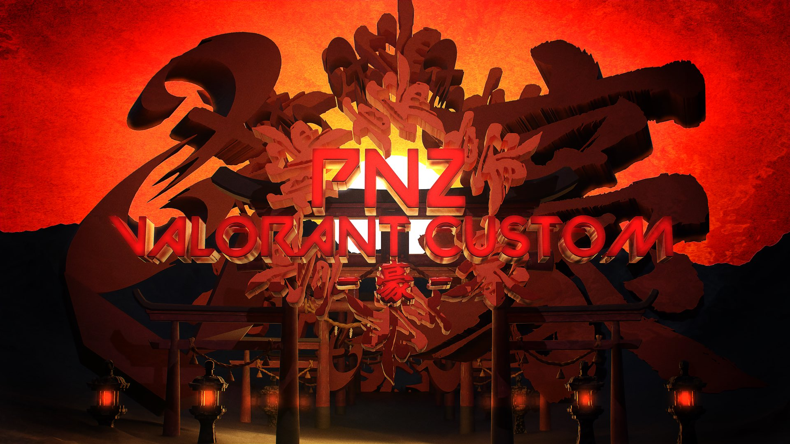

# PNZ-VALORANT-CUSTOM-GO

📅 Event Date: December 16, 2023 (Sat)  
🎮 Event Name: PNZ Valorant Custom -Go-  
🏢 Organizer: TEAM PNZ

This repository documents and shares the **streaming technical setup and production methods** used for the "PNZ Valorant Custom -Go-" event held on December 16, 2023.  
By utilizing multiple software and plugins such as NDI and OBS, we achieved remote video aggregation, VTuber video compositing, and automatic replays after each round.

---

## 🎨 Main Visual

  

---

## 🏆 Event Overview

- Date: December 16, 2023 (Sat)
- Format: Online custom match
- Title: **VALORANT**
- Number of teams: 4
- Total participants: 27 (players + staff)

---

## 🎤 Cast & Staff List

| Role | Name |
|------|------|
| Play-by-play | Tekken Kazama |
| Analyst | Rei Miyagi |
| YouTube Streaming | Rei Miyagi, Ruprous |
| Switcher | Ruprous |
| VALORANT Observer Camera | NANAMY, Tuna |
| Streaming System Construction | Ruprous, NANAMY, Rei Miyagi, Tekken Kazama |
| Discord System Construction | Sato |
| Discord Support | Bunta, Torippi Akira |

---

## 🎨 Video & Production

Video and production materials were created as follows:

- Main Visual (Ruprous)
- Opening Video (Ruprous)
- In-game Overlay (Ruprous)
- Promotion Image (Ruprous)
- Intermission Slide Materials (Ruprous)
- Scene Transition Effects (NANAMY)

---

## 🔧 Technology & Streaming Setup

### ■ Software Used

| Software | Purpose |
|----------|---------|
| VALORANT | Tournament title (custom match) |
| Discord | Voice chat and staff coordination |
| OBS Studio | Streaming & video compositing |
| OBS NDI Plugin | NDI video transmission/reception |
| NDI Tools | NDI utilities (Scan Converter, etc.) |
| NDI Bridge | NDI transfer from remote PCs |
| Advanced Scene Switcher | Scene auto-switching plugin |
| Transition Table | Scene transition control plugin |
| OBS Replay Buffer | Replay saving after rounds |
| Directory Watch Media | Auto replay playback plugin |

---

### ■ PC Setup (Roles)

| PC | Description |
|----|-------------|
| Play-by-play PC | Sends webcam video via NDI Bridge |
| Analyst PC | Composites VTuber avatar in OBS and sends via NDI Bridge |
| Observer PC 1 | VALORANT observer camera (NANAMY) |
| Observer PC 2 | VALORANT observer camera (Tuna) |
| Streaming PC | Receives all NDI video, production, and streaming (Ruprous) |

---

## 🔄 Streaming Flowchart

---

## 🎬 Production & Replay Processing

### Scene Switching & Production

- Used OBS **Advanced Scene Switcher** and **Transition Table** together for scene switching
- Smooth transitions between player POV, play-by-play/analyst, replay, standby screens, etc.
- Overlays, BGM, slides, etc. all controlled within OBS

### Replay Production After Each Round

- Save **replay buffer** with a hotkey at the end of each round
- **Directory Watch Media** automatically plays the saved replay
- Instantly review highlights and decisive moments

---

## 📄 License & Usage Policy

The contents of this repository (setup, know-how, configuration) are free for anyone to reference and use.  
However, **video, image, music, and other materials are not provided**, and redistribution or use is not permitted.  
TEAM PNZ and the production members do not waive any rights regarding the use of these materials.
