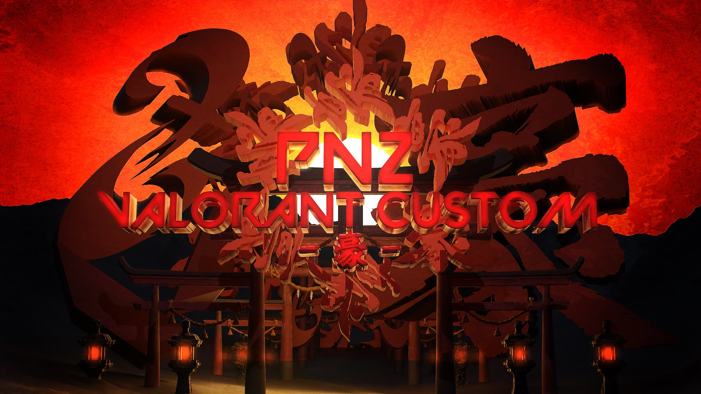

# PNZ-VALORANT-CUSTOM-GO

📅 開催日：2023年12月16日（土）  
🎮 イベント名：PNZ Valorant Custom -豪-  
🏢 主催：TEAM PNZ

本リポジトリは、2023年12月16日に開催された「PNZ Valorant Custom -豪-」の**配信技術構成や演出手法**を記録・共有するためのものです。  
NDIやOBSなど複数のソフト・プラグインを活用し、遠隔地からの映像集約やVTuber映像の合成、ラウンド後の自動リプレイなどを実現しました。

---

## 🎨 メインビジュアル

<p align="center">
  
</p>

---

## 🏆 開催概要

- 開催日：2023年12月16日（土）
- 開催形式：オンラインカスタムマッチ
- 使用タイトル：**VALORANT**
- チーム数：4チーム
- 総参加者：27名（選手＋スタッフ）

---

## 🎤 キャスト・スタッフ一覧

| 役割 | 担当 |
|------|------|
| 実況 | 鉄拳かざま |
| 解説 | 宮城玲 |
| YouTube配信 | 宮城玲、Ruprous |
| スイッチャー | Ruprous |
| VALORANT視点カメラ | NANAMY、Tuna |
| 配信システム構築 | Ruprous、NANAMY、宮城玲、鉄拳かざま |
| Discordシステム構築 | 佐藤 |
| Discordサポート | ぶんた、とりっぴ・アキラ |

---

## 🎨 映像・演出制作

映像・演出素材は以下の通り分担して制作されました。

- メインビジュアル（Ruprous）
- オープニング映像（Ruprous）
- インゲームオーバーレイ（Ruprous）
- プロモーションイメージ（Ruprous）
- 試合間スライド資料（Ruprous）
- シーントランジション演出（NANAMY）

---

## 🔧 使用技術・配信構成

### ■ 使用ソフトウェア

| ソフト | 用途 |
|--------|------|
| VALORANT | 大会タイトル（カスタムマッチ） |
| Discord | VCおよびスタッフ連携 |
| OBS Studio | 配信＆映像合成 |
| OBS NDI Plugin | NDI映像の送受信 |
| NDI Tools | NDIユーティリティ（Scan Converter等） |
| NDI Bridge | 遠隔地PCからのNDI転送 |
| Advanced Scene Switcher | シーン自動切替プラグイン |
| Transition Table | シーン間トランジション制御プラグイン |
| OBS Replay Buffer | ラウンド後のリプレイ保存 |
| Directory Watch Media | 自動リプレイ再生プラグイン |

---

### ■ 使用PC構成（役割）

| PC | 内容 |
|----|------|
| 実況PC | Webカメラ映像をNDI Bridgeで送信 |
| 解説PC | VTuberアバター映像をOBSで合成しNDI Bridgeで送信 |
| 観戦PC① | VALORANT観戦カメラ（NANAMY） |
| 観戦PC② | VALORANT観戦カメラ（Tuna） |
| 配信用PC | 全NDI映像受信・演出・配信（Ruprous） |

---

## 🔄 配信フローチャート

```mermaid
flowchart TD
    subgraph 遠隔地
      A1[実況PC<br>Webカメラ] -->|NDI Bridge| M[配信用PC]
      A2[解説PC<br>VTuberアバター] -->|NDI Bridge| M
    end

    subgraph ゲーム観戦
      B1[視点カメラPC①<br>NANAMY] -->|NDI Bridge| M
      B2[視点カメラPC②<br>Tuna] -->|NDI Bridge| M
    end

    M --> OBS[OBS Studio（配信用PC）]
    OBS --> YT[YouTube Live]
    OBS --> DC[Discord画面共有]
    DC --> A1
    DC --> A2

flowchart TD
    subgraph 遠隔地
      A1[実況PC<br>Webカメラ] -->|NDI Bridge| M[配信用PC]
      A2[解説PC<br>VTuberアバター] -->|NDI Bridge| M
    end

    subgraph ゲーム観戦
      B1[視点カメラPC①<br>NANAMY] -->|NDI Bridge| M
      B2[視点カメラPC②<br>Tuna] -->|NDI Bridge| M
    end

    M --> OBS[OBS Studio（配信用PC）]
    OBS --> YT[YouTube Live]
    OBS --> DC[Discord画面共有]
    DC --> A1
    DC --> A2
    subgraph 遠隔地
      A1[実況PC<br>Webカメラ] -->|NDI Bridge| M[配信用PC]
      A2[解説PC<br>VTuberアバター] -->|NDI Bridge| M
    end

    subgraph ゲーム観戦
      B1[視点カメラPC①<br>NANAMY] -->|NDI Bridge| M
      B2[視点カメラPC②<br>Tuna] -->|NDI Bridge| M
    end

    M --> OBS[OBS Studio（配信用PC）]
    OBS --> YT[YouTube Live]
```

---

## 🎬 配信演出・リプレイ処理

### シーンスイッチ・演出

- OBSの**シーンスイッチャー**に「Advanced Scene Switcher」と「Transition Table」を組み合わせて使用
- プレイヤー視点・実況/解説・リプレイ・待機画面などをトランジション付きで滑らかに切替
- オーバーレイ・BGM・スライドなども全てOBS内で制御

### ラウンド後のリプレイ演出

- ラウンド終了時にホットキーで**リプレイバッファを保存**
- `Directory Watch Media` により**保存されたリプレイを自動再生**
- 好プレイや勝敗の場面を即座に振り返る演出を実現

---

## 📄 ライセンス・利用方針

本リポジトリの内容（構成・ノウハウ・設定）は、誰でも自由に参考・利用いただけます。  
ただし、**映像・画像・音楽等の素材は提供しておらず**、再配布・利用は許可していません。  
TEAM PNZおよび制作メンバーは、これらの素材使用に関する権利を放棄しておらず、制限も行いません。

> 技術を使って自由にイベントを作ってくれたらうれしいで！  
> クレジット表記は任意やけど、TEAM PNZって書いてくれたら飛んで喜ぶ🐧
